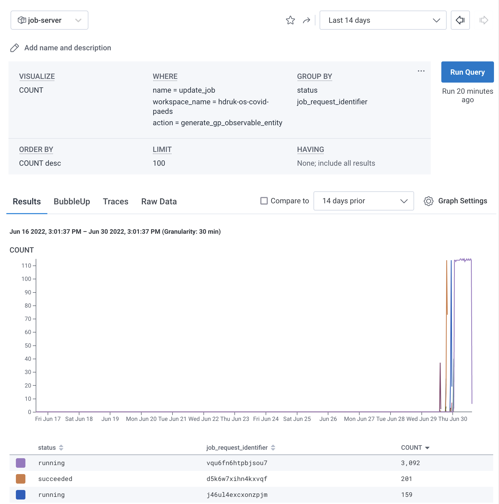
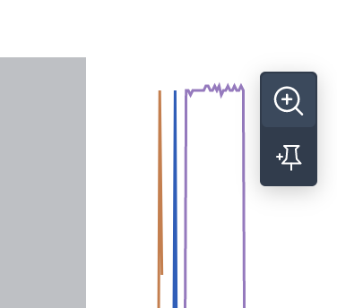

!!! warning

    These notes are a work-in-progress.
    This functionality is in limited release and subject to change. 

## Audience

This documentation is aimed at researchers who want feedback on the performance of their job requests, as well as the performance context in which their job requests happen (i.e. was the server busy or quiet at the time).

## Timings

Basic timing information is available from job and job request detail pages, for example:

The runtime for a job request is the combined runtime for all completed jobs of a job request, i.e. the runtime of each completed job is added together.

## Monitoring

### Background information

We monitor jobs indirectly. Every 30 seconds or so the job-runner sends a status update to the job-server for each currently running job. These status updates are used to display the current status in job-server and also sent to Honeycomb which allows us to explore the history of a job. 

On important thing to note is that, because a job_request can contain multiple jobs, if one job from a job_request completes successfully, it currently continues to send "success" status until all jobs from that job_request have completed. These can cause some unexpected effects in our visualisations.

Current limitations of the monitoring system:

* we can only display one visualisation per window
* we cannot embed visualisations in the job server pages
* we cannot pre-highlight one particular job/job_request in a visualisation of multiple jobs/job_requests
* time is generally always displayed in seconds (e.g. 500k seconds ~= 138hrs ~= 5.8days)

### Performance questions

#### Queueing time

We can visualise how long a job was queued for with the "Events count for this job request" link. This will show the honeycomb events for this specific job request, grouped by the reported status of the job. Nb. The height of the graph relates only to the number of reports from the job-runner to the job-server, so does not tell us anything about the job request itself.

For example, [job request 7254](https://jobs.opensafely.org/qmul/bmi-and-hba1c/bmi_and_hba1c/7254/) queued from the 27th April 2022 until the 3rd of May 2022, as we can see in this visualisation:

In comparison, [job request 7652](https://jobs.opensafely.org/university-of-nottingham/postopcovid/postopcovid/7652/) did not queue at all:

#### Job requests with multiple jobs

In order to understand the performance of job requests that contain multiple jobs, it may be useful to visualise the monitoring events for each separate job using the "Events count for running jobs from this job request" link.

For example, [job request 8680](https://jobs.opensafely.org/datalab/covid-19-vaccine-effectiveness/comparative-booster_main/8680/). This shows a lot of separate jobs running in parallel and taking a similar amount of time to finish: 

We can mouse-over the different jobs to highlight them on the graph, for example: 

This older monitoring log of [job request 7320](https://jobs.opensafely.org/university-of-bristol/post-covid-vaccinated/post-covid-vaccinated/7320/) (which predates logging job action labels to honeycomb) shows different jobs taking different lengths of time within the one job request:

#### Individual jobs

We can also dig into the events relating to one particular job, using the monitoring links on the job detail page.

For example, we can use the link "Events count for: this job" to look at [job 3c5ln3n652hbsvah](https://jobs.opensafely.org/university-of-bristol/post-covid-vaccinated/post-covid-vaccinated/7320/3c5ln3n652hbsvah) from the earlier [job request 7320](https://jobs.opensafely.org/university-of-bristol/post-covid-vaccinated/post-covid-vaccinated/7320/) like this:

We can also compare a particular job to previous runs of the same job, or potentially similar jobs, using the "Events count for: All jobs for this workspace and action in the last 14 days" and "Events count for: All jobs for this action in the last 14 days".

For example, looking at the history for [job iqd24yy2bdcyn5ho](https://jobs.opensafely.org/isaric/impact-of-covid-19-on-long-term-healthcare-use-and-costs-in-children-and-young-people/hdruk-os-covid-paeds/9938/iqd24yy2bdcyn5ho/):

Zooming in...

We can see several runs of this job, the last of which was (at the sampled time) still running, having been running for significantly longer than previous runs:

