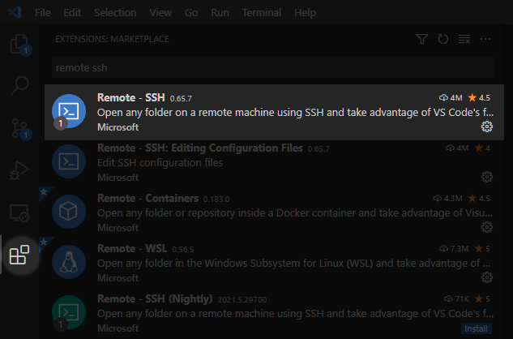

# Working remotely with Visual Studio Code

It is possible to work remotely on a machine containing the required OpenSAFELY software using Visual Studio Code.
This may be useful in cases where it is not possible to install all of the required sofware to run opensafely on your local machine, or where running this required software severely affects the performance of your local machine. 

This guide walks you through the steps required to set up the machine running the opensafely software (the "server") and the local machine from which you will access it (the "client").

## 1. Server setup

First, ensure that the opensafely software and all of its prerequisites have been installed using the [Getting Started guide](getting-started). If using this guide to connect to Gitpod, please skip to step 2.

### SSH server installation and configuration
The steps in this guide require enabling access to the server using Secure Shell Protocol (SSH).
On macOS, this requires enabling the [Remote Login](https://support.apple.com/en-gb/guide/mac-help/mchlp1066/mac) feature. 
On Windows, this requires installation of the [OpenSSH Server optional feature](https://docs.microsoft.com/en-us/windows-server/administration/openssh/openssh_install_firstuse).
On Linux, this requires installation of the OpenSSH Server such as is described in these [instructions for Ubuntu Linux](https://ubuntu.com/server/docs/service-openssh).

### Git configuration
This guide assumes you have set up a GitHub user account as per the [Getting Started guide](getting-started).  
If you have not already set up git and logged into GitHub from the server it may be neccesary to [configure your identity](https://git-scm.com/book/en/v2/Getting-Started-First-Time-Git-Setup#_your_identity).
If problems are encountered with logging into GitHub when working remotely, it may be helpful to make use of the [git credential caching](https://docs.github.com/en/get-started/getting-started-with-git/caching-your-github-credentials-in-git) feature, or to [connect to GitHub using SSH](https://docs.github.com/en/github/authenticating-to-github/connecting-to-github-with-ssh).

## 2. Client Setup

Install the Remote - SSH extension by searching for "remote ssh" within Visual Studio Code's Extensions menu or by visiting [this](https://marketplace.visualstudio.com/items?itemName=ms-vscode-remote.remote-ssh) page and clicking "Install".

 

Once installed, connect to the server by opening the Command Palette (Ctrl+Shift+P, Cmd+Shift+P on Mac) and start typing "Remote-SSH" then select `Remote-SSH:Connect to Host...`.

Visual Studio Code will then guide you through logging in to the server and will automatically install its own requirements on the server.
Once connected, you may open a folder on the server within Visual Studio Code, edit files, and issue commands to the terminal as if working on your local machine. 

## 3. (Optional) Connecting to GitPod

Using Visual Studio Code to connect to Gitpod over SSH is possible via [Gitpod's Local Companion app](https://www.gitpod.io/blog/local-app#installation). Once installed, and authenticated to your Gitpod account, the local companion app will create a temporary SSH configuration file with an entry for each one of your Gitpod workspaces. On Linux and macOS, this file is located at `/tmp/gitpod_ssh_config` and on Windows in `%TEMP%\gitpod_ssh_config`.
The Remote - SSH extension for Visual Studio Code can be configured to use this temporary configuration file via the `Remote.SSH: Config File` setting.

Once this is set, your Gitpod workspaces will then appear within the Connect to Remote SSH Host menu described in the previous step. 

## 4. Further Information

Further information is available from Microsoft on the [VS Code Remote Development](https://code.visualstudio.com/docs/remote/) page.